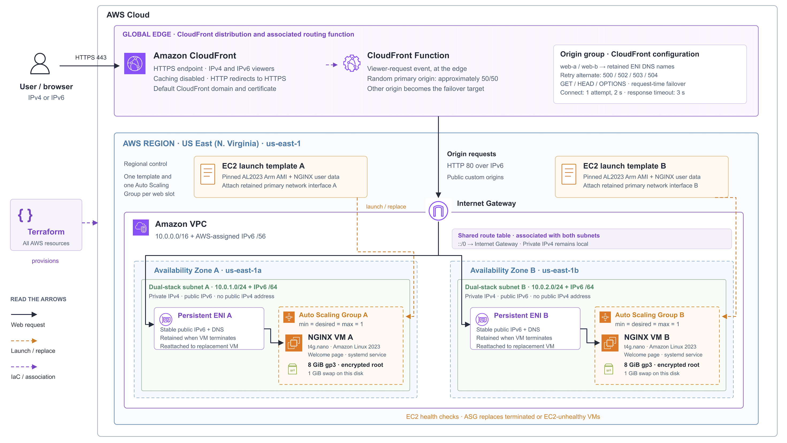

# Auto-healing web tier

This project runs an NGINX welcome page in Docker on two EC2 instances in separate availability zones. If one instance is terminated, Auto Scaling creates a replacement while the other keeps serving the page. Terraform manages the infrastructure.

I chose AWS because Auto Scaling handles instance replacement. To fit the AUD20 monthly budget, I used `us-east-1`, small `t4g.nano` instances and IPv6. CloudFront handles request distribution and failover, avoiding the ALB's hourly charge. The estimate comes to **AUD13.51 per month**, based on the usage listed below.

## How it works



NGINX runs in Docker on each VM shown in the diagram.

Users connect to CloudFront over HTTPS. A CloudFront Function randomly picks which VM should handle each request, giving roughly a 50/50 split when both are healthy. CloudFront connects to the VMs over HTTP on port 80 using IPv6. Caching is disabled, so requests reach NGINX on the VMs.

If the chosen VM cannot be reached or returns a 500, 502, 503 or 504 response, CloudFront tries the other one. That retry can make a request slower while an instance is being replaced.

Each VM has its own Auto Scaling Group, with minimum, desired and maximum capacity set to one. The launch template installs Docker, pulls the image and starts NGINX in a container. A retained network interface keeps the same IPv6 address and DNS name when the VM is replaced, so CloudFront can keep using the same origin address.

The VMs have private IPv4 addresses and public IPv6 connectivity. HTTP access is restricted to CloudFront's origin-facing IPv6 prefix list. Each VM has an encrypted 8 GiB gp3 disk and uses standard CPU credits to avoid surplus-credit charges.

Auto Scaling replaces a VM if it terminates or fails EC2 health checks. A hung NGINX process alone will not trigger replacement.

## Review the Terraform plan

You'll need Terraform 1.12 or later within 1.x, plus AWS credentials configured for your account. Run these commands from the repository root:

```sh
terraform init
terraform workspace select -or-create budget-constraint
terraform fmt -check -recursive
terraform validate
terraform plan -out=review.tfplan
terraform show -no-color review.tfplan
```

The configuration requires the `budget-constraint` workspace. Keep the committed provider lock file when running `terraform init`.

The [original plan](docs/terraform-plan.txt) shows the 20-resource deployment before containerisation. The [container update plan](docs/container-plan.txt) records the later changes to its launch templates and Auto Scaling Groups.

## Deploy

Deployment is optional for the assessment. Once you've reviewed the plan, this single apply command provisions the web tier, including the container startup configuration:

```sh
terraform apply review.tfplan
terraform output -raw website_url
terraform plan -detailed-exitcode
```

The output gives you the website URL. The follow-up plan should report `No changes` and exit with code `0`.

If you're updating an existing deployment, the new launch template takes effect when a VM is replaced. Apply does not automatically replace the running VMs. Replace A first, wait until its replacement serves the page, then replace B. Keep each group's desired capacity at one throughout.

Allow time for Docker to install on these small instances. In the live tests, the replacements took about 12.5 and 9.4 minutes to serve their first response after termination.

## Container image

The ARM64 image is available in [ECR Public](https://gallery.ecr.aws/n0l2m0r6/auto-healing-web-tier) as `nginx-1.30.4-arm64-v1`. Terraform pins its digest through `container_image`, so replacements pull the same image without registry credentials.

The VMs use `ecr-public.aws.com`, the [ECR Public endpoint that supports IPv6](https://docs.aws.amazon.com/AmazonECR/latest/public/public-ecr-requests.html). Docker uses host networking so NGINX can listen on the VM's IPv6 address. It starts on boot, and `--restart unless-stopped` brings the container back after an application exit or host reboot. The container has a 64 MiB memory limit and bounded log storage.

To build and test the image locally, start Docker and run:

```sh
docker buildx build --platform linux/arm64 --load -t auto-healing-web-tier:local .
tests/container-smoke.sh auto-healing-web-tier:local
```

The test checks the welcome page, headers, IPv6 listener, Docker health check and container restart. You can deploy using the existing public image. If you change it, follow the [publishing instructions](registry/README.md) to publish a new version.

## Test results

Both VMs were terminated and replaced, one at a time. Their replacements pulled the image and started NGINX automatically. All **3,195 requests during the replacement tests returned HTTP 200**. A follow-up Terraform plan and second apply made no changes.

The [verification results](docs/verification.md) include timings, instance IDs and the startup checks. To check the site yourself, make repeated requests and look for the welcome page and two different `X-Web-Instance` headers. Each header identifies the VM that served the request. During a replacement, keep making requests until the new instance appears in that header.

Run the CloudFront routing tests with `node --test tests/routing.test.mjs`. The [CI workflow](.github/workflows/ci.yml) also checks Terraform formatting and validation, shell syntax, and the ARM64 container build and smoke test.

## Monthly cost

This estimate is dated 9 September 2026 and assumes 730 hours in `us-east-1`, 100,000 HTTPS requests and 1 GiB sent to viewers each month. It's a small static-page workload that either VM can handle alone.

| Item | USD/month |
| --- | ---: |
| Two `t4g.nano` VMs at $0.0042/hour | 6.132 |
| Two 8 GiB gp3 disks at $0.08/GiB-month | 1.280 |
| CloudFront requests, transfer and Function invocations | 0.264 |
| ECR Public image, under 0.1 GB within the 50 GB free public-storage allowance | 0.000 |
| **Total** | **7.676** |

At **USD1 = AUD1.60**, with a **10% GST allowance**, this comes to **AUD13.51/month**. A 744-hour month with the same traffic is about AUD13.72.

The rates come from [EC2](https://aws.amazon.com/ec2/pricing/on-demand/), [EBS](https://aws.amazon.com/ebs/pricing/) and [CloudFront pay-as-you-go](https://aws.amazon.com/cloudfront/pricing/pay-as-you-go/). The CloudFront figure uses Australia/NZ request pricing and a conservative transfer rate. Compute and traffic costs do not rely on free allowances or credits.

[ECR Public](https://aws.amazon.com/ecr/pricing/) includes an ongoing 50 GB free public-storage allowance and free transfer to AWS compute. The image is under 0.1 GB, so it fits within that allowance. Running Docker uses the same VM sizes and disks listed above.

This covers the web tier at the usage above. It isn't a hard spending cap: more traffic, other resources in the account, or changes to prices and exchange rates can increase the bill.

## Cleanup

When you're finished with the deployment, remove it with:

```sh
terraform workspace select budget-constraint
terraform destroy
```
