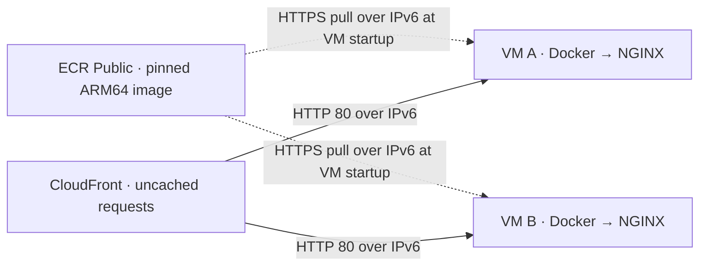

# Auto-healing web tier

Two NGINX VMs in separate AWS availability zones, managed with Terraform. Each VM has its own Auto Scaling Group, which replaces it if it terminates or fails EC2 health checks.

I chose AWS for Auto Scaling and used `us-east-1` to keep compute costs down. CloudFront handles request distribution and failover without an ALB's hourly charge. IPv6 avoids public IPv4 charges. The estimated cost is **AUD13.51 per month** for the workload below.

## Design


Each ASG has minimum, desired and maximum capacity set to one. Its launch template installs Docker, pulls the published NGINX image and starts the container. The persistent network interface keeps its IPv6 address and DNS name when the VM is replaced, so CloudFront's origin address stays the same. In the diagram, NGINX now runs inside a container on each VM.

The VMs have private IPv4 addresses and public IPv6 connectivity. Inbound HTTP is restricted to CloudFront's origin-facing IPv6 prefix list. Each VM has an encrypted 8 GiB gp3 root disk. CPU credits use standard mode to avoid surplus-credit charges.

CloudFront distributes requests across both VMs through a viewer-request CloudFront Function. For each request, the Function randomly chooses the preferred origin and sets the other as its failover target. This gives an approximately 50/50 split while both VMs are healthy. Caching is disabled, so requests reach NGINX on the VMs. CloudFront and the Function provide the request distribution and origin failover layer.

CloudFront retries the other origin on connection failures or HTTP 500, 502, 503 and 504 responses. Retries can add latency. ASG replacement uses EC2 health checks, so a hung NGINX process alone does not trigger replacement.

See the [verification results](docs/verification.md) for the live VM replacement tests, traffic observed on both instances, automatic container startup and Terraform no-change checks.

## Container image

The ARM64 image is published in [Amazon ECR Public](https://gallery.ecr.aws/n0l2m0r6/auto-healing-web-tier), tagged `nginx-1.30.4-arm64-v1`. Terraform's `container_image` default pins its digest. Anyone can pull it without registry credentials.

VMs pull from `ecr-public.aws.com`, the [IPv6-capable ECR Public endpoint](https://docs.aws.amazon.com/AmazonECR/latest/public/public-ecr-requests.html). Linux host networking lets NGINX listen on the VM's IPv6 address directly. Docker starts on boot, and `--restart unless-stopped` restarts the container after an application exit or host reboot. Each container has a 64 MiB memory limit and bounded log storage. The host passes its instance ID into the container for the `X-Web-Instance` header.



This shows the container portion of the design; the VPC, gateway, retained interfaces and ASGs are shown in the main diagram above.

Build and test locally with Docker running:

```sh
docker buildx build --platform linux/arm64 --load -t auto-healing-web-tier:local .
tests/container-smoke.sh auto-healing-web-tier:local
```

The test checks the welcome page, response headers, IPv6 listener, Docker health check and restart behaviour. The [publishing instructions](registry/README.md) explain how to publish a new image. Deployments can use the existing public image; they do not need to create a registry or build it again.

## Run a plan

Use Terraform 1.12 or later within 1.x, with AWS credentials configured for your account. Keep the provider lock file.

```sh
terraform init
terraform workspace select -or-create budget-constraint
terraform fmt -check -recursive
terraform validate
terraform plan -out=review.tfplan
terraform show -no-color review.tfplan
```

The `budget-constraint` workspace is required by this configuration.

The [saved creation plan](docs/terraform-plan.txt) documents the original 20-resource deployment. The [container update plan](docs/container-plan.txt) was applied, and both VMs were replaced one at a time. Their replacements pulled and started the pinned image automatically; **3,195/3,195 requests during the replacement tests returned HTTP 200**. A follow-up plan and second apply made no changes. Timings, instance IDs and startup evidence are recorded in [verification.md](docs/verification.md).

## Deploy and check

Deployment is optional for the assessment. After reviewing the plan:

```sh
terraform apply review.tfplan
terraform output -raw website_url
terraform plan -detailed-exitcode
```

The second plan should report `No changes` and exit with code `0`.

For an existing deployment, applying the container update changes the launch templates and ASG template versions. It does not replace the running VMs automatically. Roll out one slot at a time: replace A, wait until its replacement serves the page, then replace B. Keep desired capacity at one for each ASG. This avoids taking both origins down together. The live tests took 12 minutes 26 seconds for A and 9 minutes 23 seconds for B to serve their first response after termination. Allow for Docker installation on the CPU-limited nano instances before replacing the next VM.

Once both VMs finish starting, make repeated requests to the website URL. Check for HTTP 200, the NGINX welcome page and two different `X-Web-Instance` response headers. Then terminate one VM without reducing its ASG's desired capacity. Keep requesting the page while the ASG replaces it; check that the new VM serves requests through the same origin address.

The function's routing tests run with `node --test tests/routing.test.mjs`.

## Monthly cost

Estimate dated 9 September 2026: 730 hours in `us-east-1`, 100,000 HTTPS requests and 1 GiB delivered to viewers. This assumes a small static-page workload that either VM can serve alone. Compute and traffic are priced without free allowances or credits; the public container image uses ECR Public's ongoing free storage allowance.

| Item | USD/month |
| --- | ---: |
| Two `t4g.nano` VMs at $0.0042/hour | 6.132 |
| Two 8 GiB gp3 disks at $0.08/GiB-month | 1.280 |
| CloudFront requests, transfer and Function invocations | 0.264 |
| ECR Public image, under 0.1 GB within the 50 GB free public-storage allowance | 0.000 |
| **Total** | **7.676** |

At **USD1 = AUD1.60**, with a **10% GST allowance**, this comes to **AUD13.51/month**. A 744-hour month with the same traffic is about AUD13.72.

Rates: [EC2](https://aws.amazon.com/ec2/pricing/on-demand/), [EBS](https://aws.amazon.com/ebs/pricing/) and [CloudFront pay-as-you-go](https://aws.amazon.com/cloudfront/pricing/pay-as-you-go/). The CloudFront estimate uses Australia/NZ request pricing and a conservative transfer rate.

The VM types and disks stay the same with Docker. [ECR Public pricing](https://aws.amazon.com/ecr/pricing/) includes 50 GB of free public storage each month and free transfer to AWS compute. This small image fits within that allowance; the estimate assumes it remains available in the account.

This estimate covers this stack and workload. Extra traffic or changes to prices and exchange rates can increase the bill.

## Cleanup

To remove this stack:

```sh
terraform workspace select budget-constraint
terraform destroy
```
